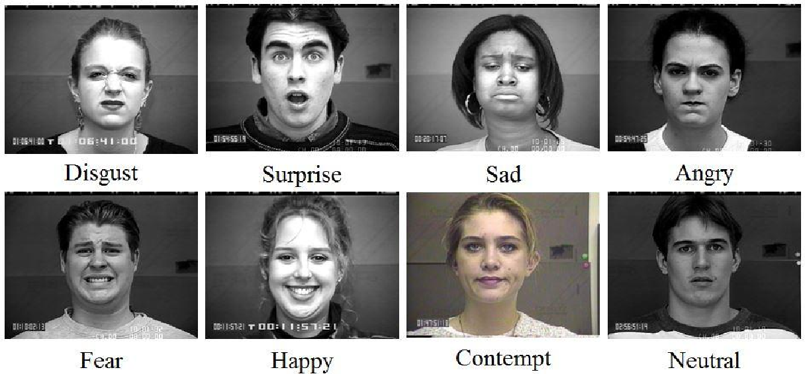
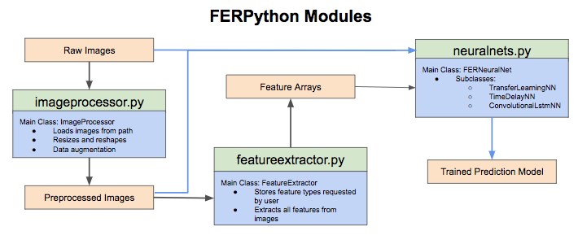
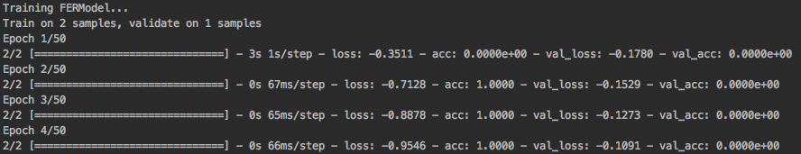

# FERPython
FERPython is a [Facial Expression Recognition (FER)](https://en.wikipedia.org/wiki/Emotion_recognition) python toolbox containing deep neural net classes that accurately predict emotions given facial expression images. These models can be trained on FER image datasets and used to predict emotions from new facial expression images.


*Figure from [@Chen2014FacialER]*

This is a community effort, initiated by the [ThoughtWorks Arts Residency](https://thoughtworksarts.io/) program in New York and based on the paper of Dr. Hongying Meng at Brunel University in London. 

Our aim is to make this research available to all as a public, easy-to-use FER toolkit that you can use fairly easily out of the box. We are also looking to expand our development community and are open to contributions - you can [contact us](mailto:aperez@thoughtworks.com) to discuss.

## Datasets

As of this moment, in order to use this repository you will have to provide your own facial expression image dataset. We aim to provide pre-trained prediction models in the near future, but you can try out the system using your own dataset or one of the small datasets we have provided in the [image-data](image-data) subdirectory.

Predictions ideally perform well on diverse datasets, illumination conditions, and subsets of the standard 7 emotion labels (i.e. happiness, anger, fear, surprise, disgust, sadness, calm/neutral) seen in FER research. Some good example public datasets are the [Extended Cohn-Kanade](http://www.consortium.ri.cmu.edu/ckagree/) and [FER+](https://github.com/Microsoft/FERPlus).

## Toolkit Overview

FERPython includes four primary modules that are plugged together to build a trained FER prediction model:

- __fermodel.py__
- __neuralnets.py__
- __imageprocessor.py__
- __featureextractor.py__

The diagram below shows these modules, their responsibilities, and the different paths training images can take through them to build a trained model. 



You never know which patterns a neural net is going to pick up on. Experimenting with raw images, altered/augmented images, and features extracted from images can lead to interesting results. The modularity of FERPython allows for this experimentation.

The FERModel class encapsulates the entire process seen in the diagram. It's job is to be the easiest tool to get a trained model up and running by using all the other module classes under the hood.

Further FERPython documentation can be found here.

## Installation

The first step is to clone the directory and open it in your terminal.

```
git clone https://github.com/thoughtworksarts/fer-python.git
cd fer-python
```

You will need to install Python 3.6.3. We recommend setting up a Python virtual environment using pyenv. Install pyenv with homebrew:

```
brew install pyenv
```

Next install Python 3.6.3 using pyenv and set it as the local distribution while in the fer-python directory:
```
pyenv install 3.6.3
pyenv local 3.6.3
```
 
Once Python 3.6.3 is set up, install all additional dependencies:

```
pip install -r requirements.txt
```

Now you're ready to go!

## Get Started in 5 minutes!

You can find example code to run each of the current neural net classes in the [examples](examples) subdirectory. The [example](examples/fermodel_example.py) of the FERModel class, shown below, is so easy to use that all you have to supply is a set of target emotions and a data path. Eventually FERModel will choose the best-performing neural net based on the set of target emotions.

#### Example using FERModel:

```python
import sys
sys.path.append('../')
from fermodel import FERModel

target_emotions = ['anger', 'fear', 'neutral', 'sad', 'happy', 'surprise', 'disgust']
csv_file_path = "image_data/sample.csv"
model = FERModel(target_emotions, csv_data_path=csv_file_path, raw_dimensions=(48,48), csv_image_col=1, csv_label_col=0, verbose=True)
model.train()
```

The example above initializes and trains an FER deep neural net model for the target emotions listed using the sample images from the a small [csv dataset](examples/image_data/sample.csv). Once you have completed the installation step, you can run the example by moving into the examples folder and running the example script like so:

```
cd examples
python fermodel_example.py
```

When you run the example, you will see the training and validation accuracies of the model being updated as it is trained on each sample image. The validation accuracy will be very low since we are only using three images for training and validation. It should look something like this:



## Guiding Principles

- __FER for Good__. FER applications have the potential to be used for malicious purposes. We want to build FERPython with a community that champions integrity, transparency, and awareness and hope to instill these values throughout development while maintaining an accessible, quality toolkit.

- __User Friendliness.__ FERPython prioritizes user experience and is designed to be as easy as possible to get an FER prediction model up and running by minimizing the total user requirements for basic use cases.

- __Experimentation to Maximize Performance__. Optimal performance in FER prediction is a primary goal. The deep neural net classes are designed to easily modify training parameters, image pre-processing options, and feature extraction methods in the hopes that experimentation in the open-source community will lead to high-performing FER prediction.

- __Modularity.__ FERPython contains four base modules (fermodel, neuralnets, imageprocessor, and featureextractor) that can be easily used together with minimal restrictions. 

## Contributing

1. Fork it!
2. Create your feature branch: `git checkout -b my-new-feature`
3. Commit your changes: `git commit -am 'Add some feature'`
4. Push to the branch: `git push origin my-new-feature`
5. Submit a pull request :D

This is a new library that has a lot of room for growth. Check out the list of open issues that we need help addressing! 


[@Chen2014FacialER]: https://www.semanticscholar.org/paper/Facial-Expression-Recognition-Based-on-Facial-Comp-Chen-Chen/677ebde61ba3936b805357e27fce06c44513a455 "Facial Expression Recognition Based on Facial Components Detection and HOG Features"