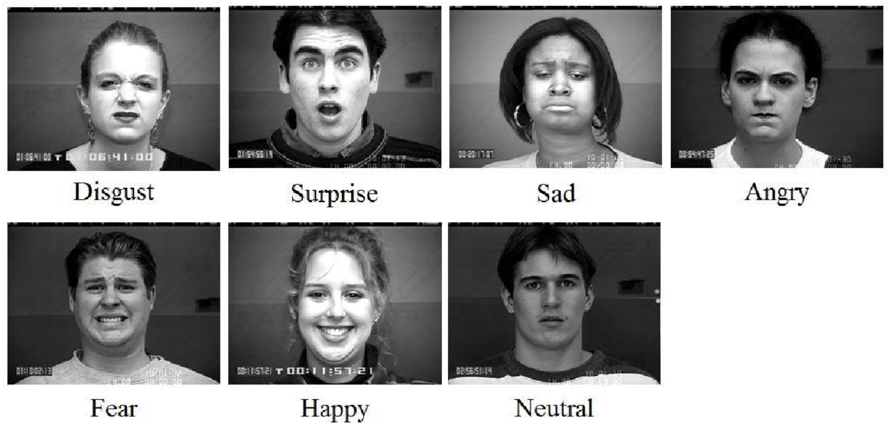
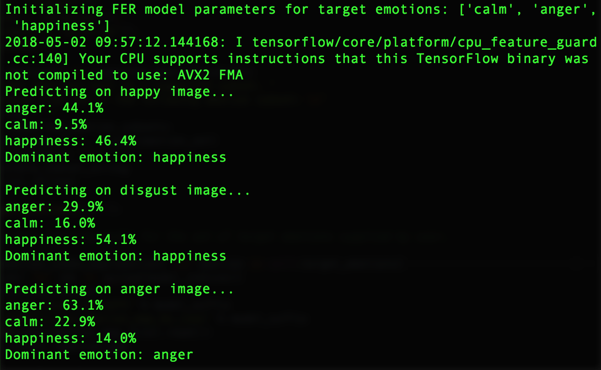
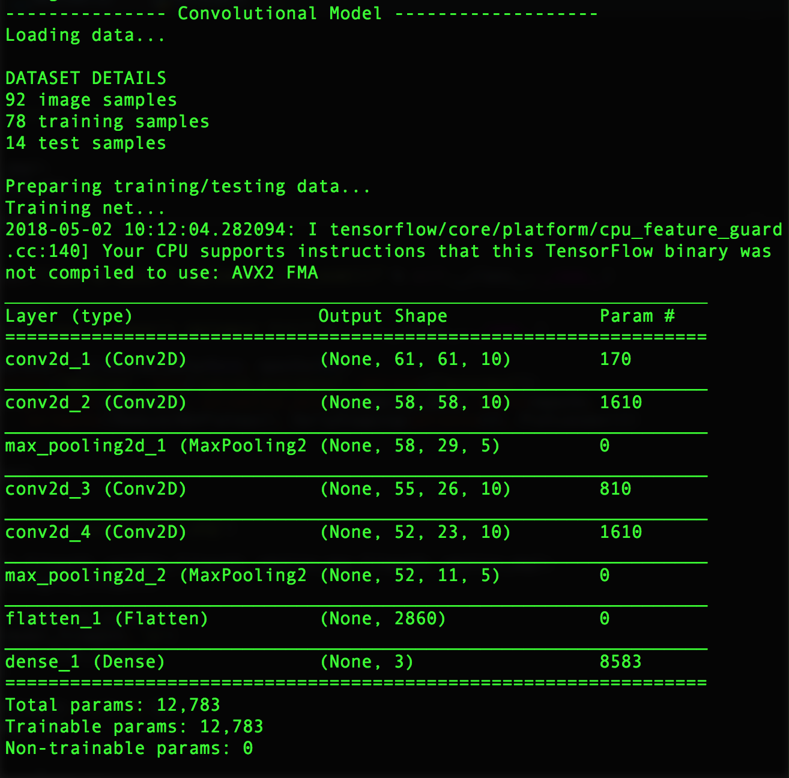
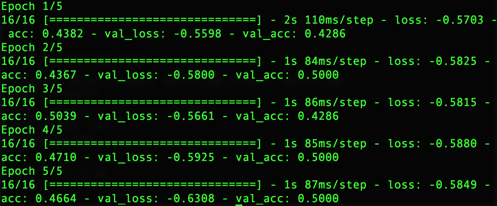
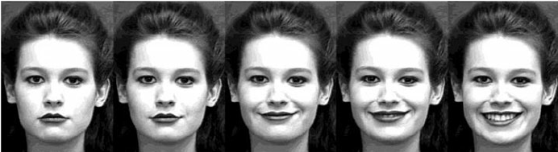

# EmoPy
EmoPy is a python toolkit with deep neural net classes which aims to make accurate predictions of emotions given images of people's faces.

  
*Figure from [@Chen2014FacialER]*

The goal of this project is to explore the field of [Facial Expression Recognition (FER)](https://en.wikipedia.org/wiki/Emotion_recognition) using existing public datasets, and make neural network models which are free, open, easy to research, and easy to integrate into different projects. The behavior of the system is highly dependent on the available data, and the developers of EmoPy created and tested the system using only publicly-available datasets.

To get a better grounding in the project you may find these write-ups useful:
* [Recognizing human facial expressions with machine learning](https://www.thoughtworks.com/insights/blog/recognizing-human-facial-expressions-machine-learning)
* [EmoPy: a machine learning toolkit for emotional expression](https://www.thoughtworks.com/insights/blog/emopy-machine-learning-toolkit-emotional-expression)

We aim to expand our development community, and we are open to suggestions and contributions. Usually these types of algorithms are used commercially, so we want to help open source the best possible version of them in order to improve public access and engagement in this area. Please [contact us](mailto:aperez@thoughtworks.com) to discuss.

## Overview

EmoPy includes several modules that are plugged together to build a trained FER prediction model.

- `fermodel.py`
- `neuralnets.py`
- `dataset.py`
- `data_loader.py`
- `csv_data_loader.py`
- `directory_data_loader.py`
- `data_generator.py`

The `fermodel.py` module uses pre-trained models for FER prediction, making it the easiest entry point to get a trained model up and running quickly.

Each of the modules contains one class, except for `neuralnets.py`, which has one interface and five subclasses. Each of these subclasses implements a different neural net architecture using the Keras framework with Tensorflow backend, allowing you to experiment and see which one performs best for your needs.

The [EmoPy documentation](https://emopy.readthedocs.io/) contains detailed information on the classes and their interactions. Also, an overview of the different neural nets included in this project is included below.

## Operating Constraints

Commercial FER projects are regularly trained on millions of labeled images, in massive private datasets. By contrast, in order to remain free and open source, EmoPy was created to work with only public datasets, which presents a major constraint on training for accurate results.

EmoPy was originally created and designed to fulfill the needs of the [RIOT project](https://thoughtworksarts.io/projects/riot/), in which audience members facial expressions are recorded in a controlled lighting environment.

For these two reasons, EmoPy functions best when the input image:

* is evenly lit, with relatively few shadows, and/or
* matches to some extent the style, framing and cropping of images from the training dataset

As of this writing, the best available public dataset we have found is [Microsoft FER+](https://github.com/Microsoft/FERPlus), with around 30,000 images. Training on this dataset should yield best results when the input image relates to some extent to the style of the images in the set.

For a deeper analysis of the origin and operation of EmoPy, which will be useful to help evaluate its potential for your needs, please read our [full write-up on EmoPy](https://www.thoughtworks.com/insights/blog/emopy-machine-learning-toolkit-emotional-expression).

## Choosing a Dataset

Try out the system using your own dataset or a small dataset we have provided in the [Emopy/examples/image_data](Emopy/examples/image_data) subdirectory. The sample datasets we provide will not yield good results due to their small size, but they serve as a great way to get started.

Predictions ideally perform well on a diversity of datasets, illumination conditions, and subsets of the standard 7 emotion labels (happiness, anger, fear, surprise, disgust, sadness, calm/neutral) seen in FER research. Some good example public datasets are the [Extended Cohn-Kanade](http://www.consortium.ri.cmu.edu/ckagree/) and [Microsoft FER+](https://github.com/Microsoft/FERPlus).

## Environment Setup

Python is compatible with multiple operating systems. If you would like to use EmoPy on another OS, please convert these instructions to match your target environment. Let us know how you get on, and we will try to support you and share you results.

Before beginning, if you do not have Homebrew installed run this command to install:

```
/usr/bin/ruby -e "$(curl -fsSL https://raw.githubusercontent.com/Homebrew/install/master/install)"
```

EmoPy runs using Python 3.6 and up, theoretically on any Python-compatible OS. We tested EmoPy using Python 3.6.6 on OSX. 

There are 2 ways you can install Python 3.6.6:

1. Directly from the [Python website] (https://www.python.org/downloads/release/python-366/), or
2. Using [pyenv] (https://github.com/pyenv/pyenv):

```
$ brew install pyenv
$ pyenv install 3.6.6
``` 

GraphViz is required for visualisation functions.

```
brew install graphviz
```

The next step is to set up a virtual environment using virtualenv. Install virtualenv with sudo.
```
sudo pip install virtualenv
```

Create and activate the virtual environment. Run:
```
python3.6 -m venv venv
```

Or if using pyenv:

```
$ pyenv exec python3.6 -m venv venv
```

Where the second `venv` is the name of your virtual environment. To activate, run from the same directory:
```
source venv/bin/activate
```
Your terminal command line should now be prefixed with ```(venv)```.

(To deactivate the virtual environment run ```deactivate``` in the command line. You'll know it has been deactivated when the prefix ```(venv)``` disappears.)

## Installation


### From PyPi
Once the virtual environment is activated, you may install EmoPy using
```
pip install EmoPy
```

### From the source

Clone the directory and open it in your terminal.

```
git clone https://github.com/thoughtworksarts/EmoPy.git
cd EmoPy
```

Install the remaining dependencies using pip.

```
pip install -r requirements.txt
```

Now you're ready to go!


## Running tests

You can run the tests with:

```
python EmoPy/tests/run_all.py
```

We encourage improvements and additions to these tests! 


## Running the examples

You can find example code to run each of the current neural net classes in [examples](EmoPy/examples). You may either download the example directory to a location of your choice on your machine, or find the example directory included in the installation.

If you choose to use the installed package, you can find the examples directory by starting in the virtual environment directory you created and typing:
```
cd lib/python3.6/site-packages/EmoPy/examples
```


The best place to start is the [FERModel example](EmoPy/examples/fermodel_example.py). Here is a listing of that code:

```python
from EmoPy.src.fermodel import FERModel
from pkg_resources import resource_filename

target_emotions = ['calm', 'anger', 'happiness']
model = FERModel(target_emotions, verbose=True)

print('Predicting on happy image...')
model.predict(resource_filename('EmoPy.examples','image_data/sample_happy_image.png'))

print('Predicting on disgust image...')
model.predict(resource_filename('EmoPy.examples','image_data/sample_disgust_image.png'))

print('Predicting on anger image...')
model.predict(resource_filename('EmoPy.examples','image_data/sample_anger_image2.png'))
```

The code above loads a pre-trained model and then predicts an emotion on a sample image. As you can see, all you have to supply with this example is a set of target emotions and a sample image.

Once you have completed the installation, you can run this example from the examples folder by running the example script.

```
python fermodel_example.py
```

The first thing the example does is load and initialize the model. Next it prints out emotion probabilities for each sample image its given. It should look like this:



To train your own neural net, use one of our FER neural net classes to get started. You can try the convolutional_model.py example:

```
python convolutional_model.py
``` 

The example first initializes the model. A summary of the model architecture will be printed out. This includes a list of all the neural net layers and the shape of their output. Our models are built using the Keras framework, which offers this visualization function.



You will see the training and validation accuracies of the model being updated as it is trained on each sample image. The validation accuracy will be very low since we are only using three images for training and validation. It should look something like this:



## Comparison of neural network models

#### ConvolutionalNN

Convolutional Neural Networks ([CNNs](https://medium.com/technologymadeeasy/the-best-explanation-of-convolutional-neural-networks-on-the-internet-fbb8b1ad5df8)) are currently considered the go-to neural networks for Image Classification, because they pick up on patterns in small parts of an image, such as the curve of an eyebrow. EmoPy's ConvolutionalNN is trained on still images.

#### TimeDelayConvNN

The Time-Delayed 3D-Convolutional Neural Network model is inspired by the work described in [this paper](http://ieeexplore.ieee.org/document/7090979/?part=1) written by Dr. Hongying Meng of Brunel University, London. It uses temporal information as part of its training samples. Instead of using still images as training samples, it uses past images from a series for additional context. One training sample will contain *n* number of images from a series and its emotion label will be that of the most recent image. The idea is to capture the progression of a facial expression leading up to a peak emotion.

  
Facial expression image sequence in Cohn-Kanade database from [@Jia2014]

#### ConvolutionalLstmNN

The Convolutional Long Short Term Memory neural net is a convolutional and recurrent neural network hybrid. Convolutional NNs  use kernels, or filters, to find patterns in smaller parts of an image. Recurrent NNs ([RNNs](https://deeplearning4j.org/lstm.html#recurrent)) take into account previous training examples, similar to the Time-Delay Neural Network, for context. This model is able to both extract local data from images and use temporal context.

The Time-Delay model and this model differ in how they use temporal context. The former only takes context from within video clips of a single face as shown in the figure above. The ConvolutionLstmNN is given still images that have no relation to each other. It looks for pattern differences between past image samples and the current sample as well as their labels. It isn’t necessary to have a progression of the same face, simply different faces to compare.

  
Figure from [@vanGent2016]

#### TransferLearningNN

This model uses a technique known as [Transfer Learning](https://www.analyticsvidhya.com/blog/2017/06/transfer-learning-the-art-of-fine-tuning-a-pre-trained-model/), where pre-trained deep neural net models are used as starting points. The pre-trained models it uses are trained on images to classify objects. The model then retrains the pre-trained models using facial expression images with emotion classifications rather than object classifications. It adds a couple top layers to the original model to match the number of target emotions we want to classify and reruns the training algorithm with a set of facial expression images. It only uses still images, no temporal context.

#### ConvolutionalNNDropout

This model is the most recent addition to EmoPy. It is a 2D Convolutional Neural Network that implements dropout, batch normalization, and L2 regularization. It is currently performing with a training accuracy of 0.7045 and a validation accuracy of 0.6536 when classifying 7 emotions. Further training will be done to determine how it performs on smaller subsets of emotions.

## Performance

Before implementing the ConvolutionalNNDropout model, the ConvolutionalLstmNN model was performing best when classifying 7 emotions with a validation accuracy of 47.5%. The table below shows accuracy values of this model and the TransferLearningNN model when trained on all seven standard emotions and on a subset of three emotions (fear, happiness, neutral). They were trained on 5,000 images from the [FER+](https://github.com/Microsoft/FERPlus) dataset.

| Neural Net Model    | 7 emotions        |                     | 3 emotions        |                     |
|---------------------|-------------------|---------------------|-------------------|---------------------|
|                     | Training Accuracy | Validation Accuracy | Training Accuracy | Validation Accuracy |
| ConvolutionalLstmNN | 0.6187            | 0.4751              | 0.9148            | 0.6267              |
| TransferLearningNN  | 0.5358            | 0.2933              | 0.7393            | 0.4840              |

Both models are overfitting, meaning that training accuracies are much higher than validation accuracies. This means that the models are doing a really good job of recognizing and classifying patterns in the training images, but are overgeneralizing. They are less accurate when predicting emotions for new images.

If you would like to experiment with different parameters using our neural net classes, we recommend you use [FloydHub](https://www.floydhub.com/about), a platform for training and deploying deep learning models in the cloud. Let us know how your models are doing! The goal is to optimize the performance and generalizability of all the FERPython models.

## Guiding Principles

These are the principals we use to guide development and contributions to the project:

- __FER for Good__. FER applications have the potential to be used for malicious purposes. We want to build EmoPy with a community that champions integrity, transparency, and awareness and hope to instill these values throughout development while maintaining an accessible, quality toolkit.

- __User Friendliness.__ EmoPy prioritizes user experience and is designed to be as easy as possible to get an FER prediction model up and running by minimizing the total user requirements for basic use cases.

- __Experimentation to Maximize Performance__. Optimal performance in FER prediction is a primary goal. The deep neural net classes are designed to easily modify training parameters, image pre-processing options, and feature extraction methods in the hopes that experimentation in the open-source community will lead to high-performing FER prediction.

- __Modularity.__ EmoPy contains four base modules (`fermodel`, `neuralnets`, `imageprocessor`, and `featureextractor`) that can be easily used together with minimal restrictions.

## Contributing

1. Fork it!
2. Create your feature branch: `git checkout -b my-new-feature`
3. Commit your changes: `git commit -am 'Add some feature'`
4. Push to the branch: `git push origin my-new-feature`
5. Submit a pull request :D

This is a new library that has a lot of room for growth. Check out the list of open issues that we need help addressing!

[@Chen2014FacialER]: https://www.semanticscholar.org/paper/Facial-Expression-Recognition-Based-on-Facial-Comp-Chen-Chen/677ebde61ba3936b805357e27fce06c44513a455 "Facial Expression Recognition Based on Facial Components Detection and HOG Features"

[@Jia2014]: https://www.researchgate.net/figure/Fig-2-Facial-expression-image-sequence-in-Cohn-Kanade-database_257627744_fig1 "Head and facial gestures synthesis using PAD model for an expressive talking avatar"

[@vanGent2016]: http://www.paulvangent.com/2016/04/01/emotion-recognition-with-python-opencv-and-a-face-dataset/ "Emotion Recognition With Python, OpenCV and a Face Dataset. A tech blog about fun things with Python and embedded electronics."

## Contributors

Thanks goes to these wonderful people ([emoji key](https://allcontributors.org/docs/en/emoji-key)):

<!-- ALL-CONTRIBUTORS-LIST:START - Do not remove or modify this section -->
<!-- prettier-ignore-start -->
<!-- markdownlint-disable -->
<table>
  <tr>
    <td align="center"><a href="https://github.com/angelicaperez37"><br /><sub><b>angelicaperez37</b></sub></a><br /><a href="https://github.com/thoughtworksarts/EmoPy/commits?author=angelicaperez37" title="Code">💻</a> <a href="#blog-angelicaperez37" title="Blogposts">📝</a> <a href="https://github.com/thoughtworksarts/EmoPy/commits?author=angelicaperez37" title="Documentation">📖</a></td>
    <td align="center"><a href="https://github.com/sbriley"><br /><sub><b>sbriley</b></sub></a><br /><a href="https://github.com/thoughtworksarts/EmoPy/commits?author=sbriley" title="Code">💻</a></td>
    <td align="center"><a href="http://tania.pw"><br /><sub><b>Sofia Tania</b></sub></a><br /><a href="https://github.com/thoughtworksarts/EmoPy/commits?author=stania1" title="Code">💻</a></td>
    <td align="center"><a href="https://jahya.net"><br /><sub><b>Andrew McWilliams</b></sub></a><br /><a href="https://github.com/thoughtworksarts/EmoPy/commits?author=microcosm" title="Documentation">📖</a> <a href="#ideas-microcosm" title="Ideas, Planning, & Feedback">🤔</a></td>
    <td align="center"><a href="http://www.websonthewebs.com"><br /><sub><b>Webs</b></sub></a><br /><a href="https://github.com/thoughtworksarts/EmoPy/commits?author=weberswords" title="Code">💻</a></td>
    <td align="center"><a href="https://github.com/saragw6"><br /><sub><b>Sara GW</b></sub></a><br /><a href="https://github.com/thoughtworksarts/EmoPy/commits?author=saragw6" title="Code">💻</a></td>
    <td align="center"><a href="http://www.linkedin.com/in/meganesu"><br /><sub><b>Megan Sullivan</b></sub></a><br /><a href="https://github.com/thoughtworksarts/EmoPy/commits?author=meganesu" title="Documentation">📖</a></td>
  </tr>
  <tr>
    <td align="center"><a href="https://github.com/sadnantw"><br /><sub><b>sadnantw</b></sub></a><br /><a href="https://github.com/thoughtworksarts/EmoPy/commits?author=sadnantw" title="Code">💻</a> <a href="https://github.com/thoughtworksarts/EmoPy/commits?author=sadnantw" title="Tests">⚠️</a></td>
    <td align="center"><a href="http://xuv.be"><br /><sub><b>Julien Deswaef</b></sub></a><br /><a href="https://github.com/thoughtworksarts/EmoPy/commits?author=xuv" title="Code">💻</a> <a href="https://github.com/thoughtworksarts/EmoPy/commits?author=xuv" title="Documentation">📖</a></td>
    <td align="center"><a href="https://github.com/sinbycos"><br /><sub><b>Tanushri Chakravorty</b></sub></a><br /><a href="https://github.com/thoughtworksarts/EmoPy/commits?author=sinbycos" title="Code">💻</a> <a href="#example-sinbycos" title="Examples">💡</a></td>
    <td align="center"><a href="http://linas.org"><br /><sub><b>Linas Vepštas</b></sub></a><br /><a href="#plugin-linas" title="Plugin/utility libraries">🔌</a></td>
    <td align="center"><a href="https://emilysachs.com"><br /><sub><b>Emily Sachs</b></sub></a><br /><a href="https://github.com/thoughtworksarts/EmoPy/commits?author=emilysachs" title="Code">💻</a></td>
    <td align="center"><a href="https://github.com/dianagamedi"><br /><sub><b>Diana Gamez</b></sub></a><br /><a href="https://github.com/thoughtworksarts/EmoPy/commits?author=dianagamedi" title="Code">💻</a></td>
    <td align="center"><a href="https://github.com/dtoakley"><br /><sub><b>dtoakley</b></sub></a><br /><a href="https://github.com/thoughtworksarts/EmoPy/commits?author=dtoakley" title="Documentation">📖</a> <a href="https://github.com/thoughtworksarts/EmoPy/commits?author=dtoakley" title="Code">💻</a></td>
  </tr>
  <tr>
    <td align="center"><a href="https://github.com/anjutiwari"><br /><sub><b>Anju</b></sub></a><br /><a href="#maintenance-anjutiwari" title="Maintenance">🚧</a></td>
    <td align="center"><a href="https://github.com/satishdash"><br /><sub><b>Satish Dash</b></sub></a><br /><a href="#maintenance-satishdash" title="Maintenance">🚧</a></td>
  </tr>
</table>

<!-- markdownlint-enable -->
<!-- prettier-ignore-end -->
<!-- ALL-CONTRIBUTORS-LIST:END -->

This project follows the [all-contributors](https://github.com/all-contributors/all-contributors) specification. Contributions of any kind welcome!

## Projects built on EmoPy
- [RIOT AI](http://karenpalmer.uk/portfolio/riot/)
- [ROS wrapper for EmoPy](https://github.com/hansonrobotics/ros_emopy)

Want to list you project here? Please file an [issue](issues/new) (or pull request) and tell us how EmoPy is helping you.
